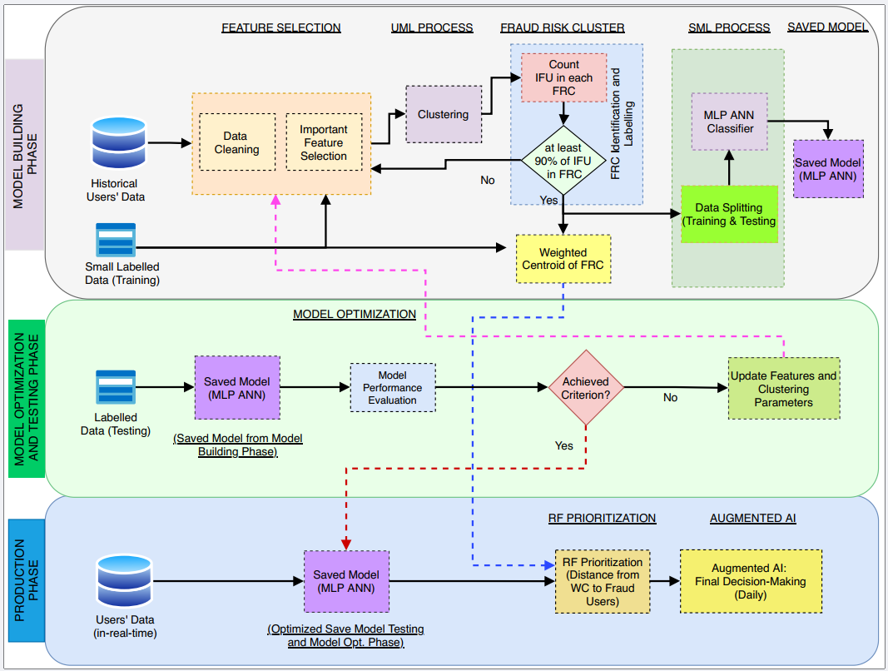

# Hybrid Fraud Detection Model for Invoicing Platforms

[](https://www.python.org/downloads/release/python-360/) 
[](https://opensource.org/licenses/Apache-2.0)

### Reference Paper: 
Wahid, Dewan F; Hassini, Elkafi; ", An augmented AI-based hybrid fraud detection framework for invoicing platforms, *Applied Intelligence*, 54, 2, 1297-1310, 2024. **[[Available Online](https://link.springer.com/article/10.1007/s10489-023-05223-x)]**

### Project Description
A hybrid fraud detection framework when only a small set of labelled (fraud/non-fraud) data is available, and human input is required in the final decision-making step. This framework used a combination of unsupervised and supervised machine learning, red-flag prioritization, and an augmented AI approach containing a human-in-the-loop process.


### Install Packages 
The requirements.txt file contains list all Python libraries that will require to this project and, they will be installed using:

```
pip install -r requirements.txt
```


### Quick Start

This respository containts the `Production Phase` of the hybrid fraud detection model.

The `main.py` identifies any new users to the platform, analyze their activities, and generate a Red-Flaged (RF) prioritization list with a corresponding Fraud Risk Score (FRC) to review for the human-in-the-loop agent. 

<p align="center"> </p> 
<p align="center"> (Fig: Hybrid Fraud Detection Model for Invoicing Platform) </p>  

If you have any questions, feel free to email at dfwahid@gmail.com 
